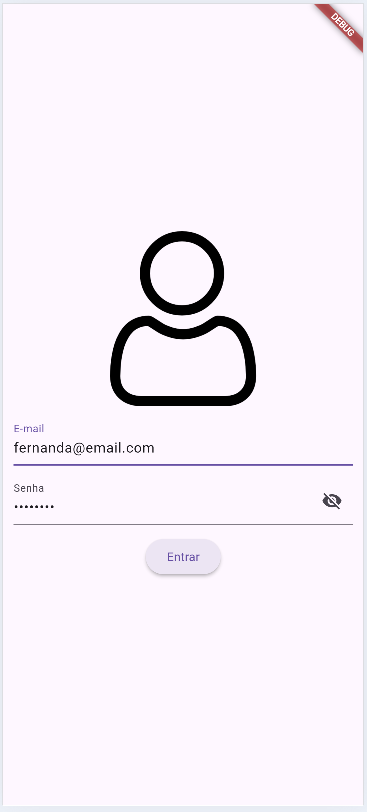
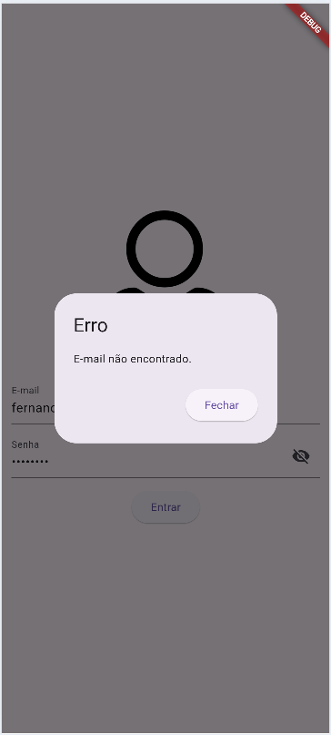
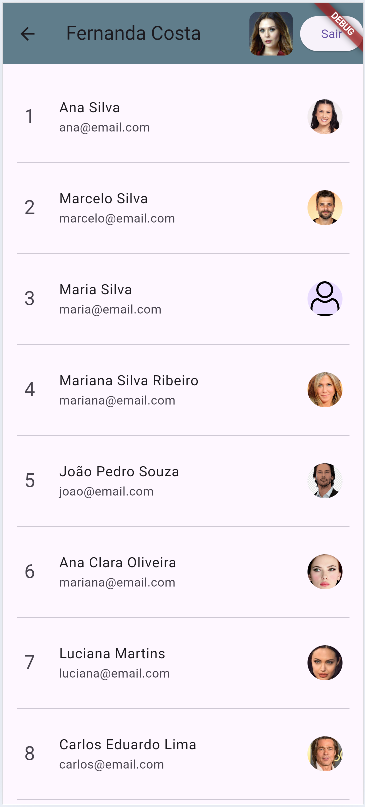

# Login arquivo JSON
Apicaçao flutter de exemplo de processo de login com:
|Assunto|Comando ou biblioteca|
|-|:-:|
|Navegação push, pop|Navegator|
|Compartilhamento de dados entre telas (shared, "LocalStorage")|Biblioteca: shared_preferences.dart<br>SharedPreferences|
|Leitura de dados de aquivo local de texto JSON|rootBundle.loadString()|
|Conversão de dados|json.encode(), json.decode()|
|Imagens locais e da web|Image.asset(), Image.network()|
|Ações por gestos|GestureDetector|
|Listas|List<>, ListView|

## Tecnologias
- Flutter

## Telas




## Como testar
- Clone o repositório
- Abra com vscode e em um terminal execute:
```bash
flutter pub get
flutter run
```

## Outras informações
Comando para gerar o .apk para instalar no Android e testar
```bash
flutter build apk --release
```
- As imagens .network geralmente não aparecem quando instalamos o .apk no dispositivo, para corrigir temos que adicionar a permição no arquivo AndroidManifest.xml que fica localizado em android/app/src/main antes de gerar o .apk
```xml
<uses-permission android:name="android.permission.INTERNET"/>
```
- Neste repositório existe um arquivo **app-release.apk** na pasta assets caso queira testar em seu celular Android, basta fazer download e instalar.


## Atividades
- 1 Desenvolva um aplicativo com **duas** telas uma **splash** com alguma animação de entrada e saída e outra tela chamada **home** listando os produtos em de um arquivo chamado assets/produtos.json conforme os a seguir:
```json
[
    {
        "id": 1,
        "nome": "Camiseta regata",
        "descricao": "Camiseta regata masculina",
        "preco": 38.9,
        "quantidade": 10,
        "img":""
    },
    {
        "id": 2,
        "nome": "Camisa polo",
        "descricao": "Camisa polo masculina",
        "preco": 45.9,
        "quantidade": 5,
        "img":""
    },
    {
        "id": 3,
        "nome": "Camiseta regata",
        "descricao": "Camiseta regata feminina",
        "preco": 78.9,
        "quantidade": 20,
        "img":""
    },
    {
        "id": 4,
        "nome": "Calsa Jeans",
        "descricao": "Calsa Jeans masculina",
        "preco": 66.9,
        "quantidade": 10,
        "img":"https://cdn.dooca.store/212/products/4802700173-2_450x600.jpg?v=1712174230&webp=0"
    },
    {
        "id": 5,
        "nome": "Calça Jeans",
        "descricao": "Calça Jeans feminina",
        "preco": 134.9,
        "quantidade": 10,
        "img":"https://dzg5mdpaq0k37.cloudfront.net/Custom/Content/Products/51/33/5133_calca-jeans-feminina-cos-alto-revolucionaria-80860_m3_638520460869457731.webp"
    },
    {
        "id": 6,
        "nome": "Cueca",
        "descricao": "Cueca box simples",
        "preco": 14.9,
        "quantidade": 50,
        "img":"https://img.irroba.com.br/filters:fill(fff):quality(80)/sergiosc/catalog/produtos-2023/141112023/11010781g-1.jpg"
    },
    {
        "id": 7,
        "nome": "Moletom",
        "descricao": "Moletom masculina",
        "preco": 129.9,
        "quantidade": 10,
        "img":"https://hiatto.cdn.magazord.com.br/img/2025/05/produto/17556/11m0026-002-blusa-de-moletom-masculino-com-capuz-e-bolso-canguru-liso-hiatto-1.png?ims=630x945"
    },
    {
        "id": 8,
        "nome": "Moletom",
        "descricao": "Moletom feminino",
        "preco": 139.9,
        "quantidade": 10,
        "img":"https://hiatto.cdn.magazord.com.br/img/2025/03/produto/15935/11f0096-002-blusa-de-moletom-feminino-capuz-e-bolso-canguru-elegant-preto-hiatto-1.png?ims=630x945"
    },
    {
        "id": 9,
        "nome": "Saia Jeans",
        "descricao": "Saia jeans",
        "preco": 109.9,
        "quantidade": 20,
        "img":"https://cdn.awsli.com.br/600x450/2459/2459342/produto/165821892/10--2--bylw4ginkb.jpg"
    },
    {
        "id": 10,
        "nome": "Mini saia",
        "descricao": "Mini saia",
        "preco": 159.9,
        "quantidade": 10,
        "img":"https://m.media-amazon.com/images/I/41wh9ZPM6NL._AC_SY1000_.jpg"
    }
]
```
- 2 Crie outro aplicativo com duas telas, uma de **login** e outra chamada **detalhes**, este aplicativo deve fazer login autenticando com um dos usuários do arquivo assets/usuarios.json com os dados a seguir e exibir todos os dados do usuário, menos a senha, na tela de detalhes em um formulário onde os dados possam ser editados, ao concluir a edição dos dados o usuário poderá clicar em um botão **"Salvar"** que deve [criar um arquivo local](./arquivos.md) em **Documentos** no celular com o primeiro nome do usuário.txt salvando perfil do usuário editado:
```json
[
  {
    "id": 2,
    "nome": "Mariana Silva Ribeiro",
    "email": "mariana@email.com",
    "senha": "senha123",
    "cep":"13914-552",
    "numero":"2527",
    "complemento":"BL19 AP44",
    "telefone":"(19)99999-9999",
    "avatar": "https://raw.githubusercontent.com/wellifabio/senai2023/main/2des/projetos/assets/avatares/cli1.png"
  },
  {
    "id": 3,
    "nome": "João Pedro Souza",
    "email": "joao@email.com",
    "senha": "senha123",
    "cep":"13476-622",
    "numero":"75",
    "complemento":"",
    "telefone":"(19)88888-8888",
    "avatar": "https://raw.githubusercontent.com/wellifabio/senai2023/main/2des/projetos/assets/avatares/cli2.png"
  },
  {
    "id": 6,
    "nome": "Ana Clara Oliveira",
    "email": "mariana@email.com",
    "senha": "senha123",
    "cep":"13905-522",
    "numero":"74",
    "complemento":"Fundos",
    "telefone":"(19)77777-7777",
    "avatar": "https://raw.githubusercontent.com/wellifabio/senai2023/main/2des/projetos/assets/avatares/cli3.png"
  }
]
```